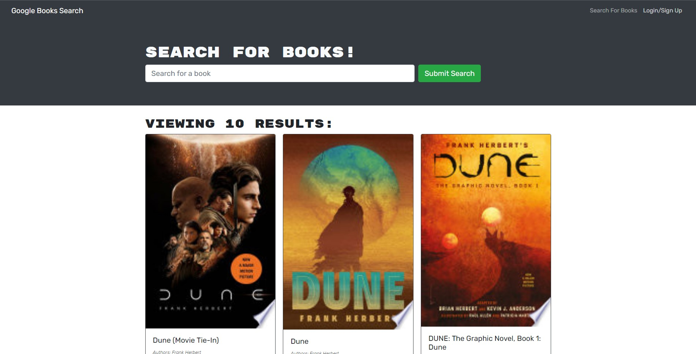

# Book Search Engine

## Description
This project lets the user create an account, search for books, and save their favorites.

## Table of Contents
* [Installation](#installation)
* [Usage](#usage)
* [Contributing](#contributing)
* [Questions](#questions)

## Installation

* Install dependencies with npm install or npm i
* Type npm start in the terminal to run the server
* Use 'localhost:3001' in your browser to view the application

You can also use the application on [Heroku](https://book-search-engine-bl.herokuapp.com/)

## Usage

* Use the [Heroku link](https://book-search-engine-bl.herokuapp.com/) or the installation method above to start.
* A user can type a search term  in a search box and the results appear.
* The user can save books by clicking "Save This Book!" under each search result.
* A user can view their saved books on a separate page.
* The user can also remove saved books.

## Contributing
If you're interested in contributing, please reach out to me via email. You can find it at the bottom under questions.

## Questions
* Email me at <a href= "mailto: brendanjflewis@icloud.com">brendanjflewis@icloud.com</a>
* Check out my Github profile at <a href= "https://www.github.com/brendanjflewis">brendanjflewis</a>